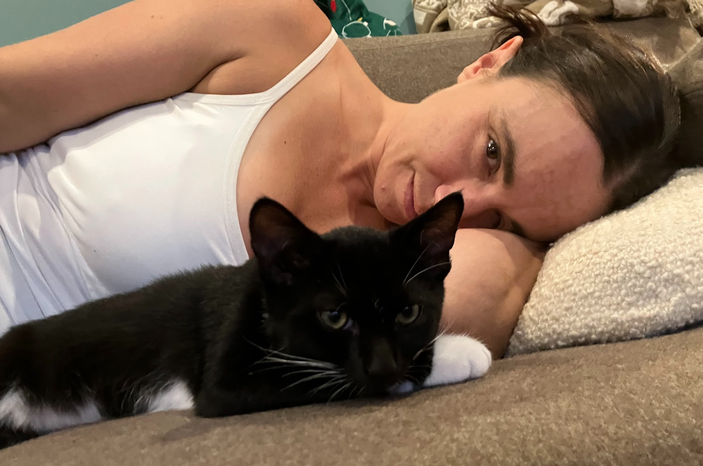

    Stripes and Boots - a brother-sister pair of adorable and playful 10-week-old kittens. We watched these two cuties for 11 days in their home in Highland Park, NJ. 

    Boots, the larger but more timid of the pair, explored the house cautiously, retreating under the couch at any new noise. Stripes, smaller but headstrong, loved to test her limits and explore new spaces. They both strongly disliked the kitchen vent fan.

    Most of all, they both loved to play. They chased one another around the house for hours, in and out of the cardboard cat “condo” complex Jeff constructed for them. We introduced them to the joys of pipecleaners, string and crinkly brown paper, and they never looked back.

    Once they were all tuckered out, Boots and Stripes were always eager for a good snuggle session. Stripes preferred to curl up into an adorable little cat ball next to Jeff's face, while Boots preferred to sprawl out on the couch next to Erin. 

    It was hard to leave these two at the end of our stay, but we were grateful for the opportunity to love on them while their family was away. 

